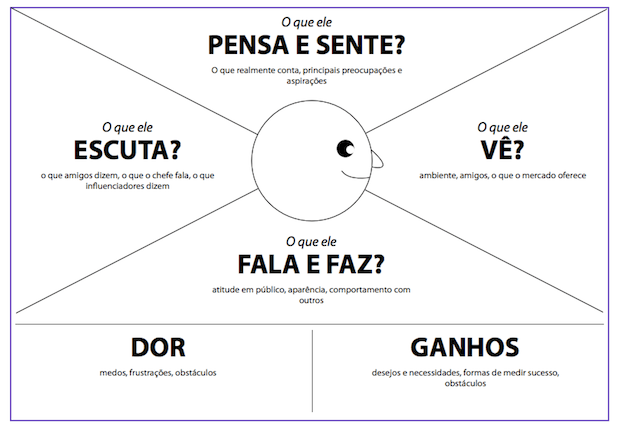

# Personas

> **_NOTE:_**: A Persona transforma o Perfil do Usuário (dados reais, agregados) em um arquétipo fictício único, que humaniza o público-alvo e orienta decisões de design. Use o segmento priorizado na etapa anterior como base — não invente características que contradigam a pesquisa.

- Apresente apenas as personas primárias (o(s) segmento(s) priorizado(s) no Perfil do Usuário). Personas secundárias só se forem realmente necessárias para alguma decisão de design.
- Para cada persona, apresente: nome, foto de rosto, idade, ocupação, uma frase/citação que resuma sua motivação ou frustração principal, objetivos em relação ao produto/serviço e nível de familiaridade com tecnologia.
- Toda característica da persona deve ser rastreável aos dados coletados na pesquisa (não adicione traços "porque parece razoável").

> **_NOTE:_**: Cada persona deve ter uma foto de rosto que a represente. Vocês podem utilizar esse [site](https://thispersondoesnotexist.com/) para gerar as fotos.

# Mapa de Empatia

- Determine o mapa de empatia[1] de pelo menos duas personas primárias e uma secundária.
  - O que o usuário vê: aqui estamos falando do ambiente visual em que o usuário se encontra. Ou seja, o que ele efetivamente enxerga, as pessoas e objetos que estão ao seu redor. Isso ajuda a entender o contexto em que o usuário está inserido e as influências visuais que está recebendo.
  - O que o usuário ouve: neste quadrante, buscamos entender o que o usuário está ouvindo, os sons que o cercam e como eles influenciam suas ações.
  - O que o usuário diz e faz: aqui consideramos ações e comportamentos que o usuário apresenta durante sua interação com serviço ou produto.
  - O que o usuário pensa e sente: neste quadrante, buscamos entender os pensamentos, sentimentos, emoções e percepções que o usuário tem em relação ao serviço ou produto. Quais expectativas o usuário cria sobre o serviço ou produto? Que tipo de serviço ou produto mais agrada essa persona?
  - Dores: quando falamos sobre dores do usuário, estamos fazendo referência a quaisquer obstáculos, necessidades ou frustrações que o usuário possa experimentar ao tentar realizar uma tarefa ou alcançar um objetivo. Isso inclui, por exemplo, problemas de usabilidade, dificuldades de acesso ou outros desafios que podem afetar a experiência do usuário.
  - Ganhos: nesse caso estamos falando de quaisquer benefícios ou recompensas que o usuário possa experimentar ao utilizar o serviço ou produto. Isso pode incluir economia de tempo ou facilidade de uso, por exemplo. Que desejos do usuário o serviço ou produto satisfaz?

> **_NOTE:_**: Contexto de Uso e Jornada do Usuário ficam na próxima entrega ([Cenário de Análise/Problema](5_cenarios.md)).

---

## Entrega

[Perfil do Usuário](3_perfil_usuario.md).

### Persona primária: Marcos Menezes

| Campo | Descrição |
| :---- | :---- |
| **Idade** | 21 anos |
| **Ocupação** | Gerente de frota da empresa IHC Saneamento, estudante de engenharia civil |
| **Citação** | "Cara, preencher as planilhas da empresa é um saco." |
| **Objetivos** | Poder preencher sua ficha de trabalho, constando a disponibilidade e alocação de veículos por obra, controle de pagamentos e combustíveis de forma mais dinâmica, além de possuir indicativos automáticos. |
| **Nível de tecnologia** | Alto — usa smartphone e computador pessoal o dia todo. |
| **Frustração principal** | As planilhas de resultado e os relatórios de auditorias são feitos manualmente por ele. |

### Mapa de Empatia — Marcos

| Quadrante | Descrição |
| :---- | :---- |
| **Vê** | Diversos papéis impressos, fichas sem preenchimento e confusão no controle de alocação dos veículos. |
| **Ouve** | Motoristas comentando que o caminhão vinculados a eles está indisponível. Gerentes reclamando que operação atrasou por carros em obras diferentes. |
| **Diz e faz** | Acompanha todo o contas à pagar, recebe a ficha de trabalho dos motoristas e preenche os dados nas planilhas manuais. |
| **Pensa e sente** | Acredita que perde muito tempo fazendo coisas de mais para processos simples. |
| **Dores** | Manualização, falta de clareza do processo, peca de dados frequentes, lentidão na rotina de trabalho. |
| **Ganhos** | Entrega rápida e automatizada, dados mais seguro e de fácil consulta, relatórios gerados automático trazendo facilidade e agilidade pra todos os setores. |

### Persona primária: Ricardo Almeida

| Campo | Descrição |
| :---- | :---- |
| **Idade** | 42 anos |
| **Ocupação** | Proprietário e gestor de uma empresa de locação de veículos e caminhões, prestadora de serviços para obras, e funcionário CLT de outra empresa. |
| **Citação** | "Eu preciso saber o que está acontecendo com meus caminhões mesmo quando estou no meu trabalho." |
| **Objetivos** | 	Ter controle completo dos 25 caminhões, acompanhar em quais obras cada veículo está locado, controlar disponibilidade e manutenções, acompanhar contas a pagar e receber, consultar informações pelo celular e reduzir a dependência de planilhas. |
| **Nível de tecnologia** | Médio — utiliza smartphone diariamente, principalmente para comunicação e trabalho, mas atualmente depende de planilhas e computador para administrar a empresa. |
| **Frustração principal** | Não conseguir acompanhar a empresa em tempo real enquanto está trabalhando na empresa onde é CLT, dependendo de planilhas que ficam no computador e demandam atualização e consulta manual. |

### Mapa de Empatia — Joel

| Quadrante | Descrição |
| :---- | :---- |
| **Vê** | 	Planilhas extensas, informações espalhadas, registros de manutenções, documentos de veículos, contratos de locação e anotações sobre as obras onde os caminhões estão trabalhando. |
| **Ouve** | Motoristas e responsáveis pelas obras solicitando informações sobre veículos, avisando sobre problemas mecânicos e manutenções. Também recebe cobranças de clientes e fornecedores relacionadas a pagamentos, locações e serviços. |
| **Diz e faz** | dministra praticamente sozinho a operação da empresa, acompanha os 25 caminhões, negocia locações, controla contratos, verifica manutenções, acompanha contas a pagar e receber e atualiza planilhas. Durante o expediente CLT, tenta resolver demandas da empresa de locação pelo celular, mesmo sem conseguir acessar facilmente todas as informações. |
| **Pensa e sente** | Sente que precisa estar constantemente verificando se está tudo certo com os caminhões e com as obras. Tem receio de esquecer uma manutenção, perder um prazo de pagamento, deixar de cobrar um cliente ou não perceber algum problema operacional enquanto está trabalhando na empresa CLT. |
| **Dores** | Dependência de planilhas, dificuldade de acessar informações fora do computador, excesso de tarefas concentradas em uma única pessoa, falta de visão geral da frota, dificuldade para acompanhar manutenções e vencimentos, informações descentralizadas, risco de esquecer compromissos financeiros e dificuldade para saber rapidamente onde cada caminhão está alocado. |
| **Ganhos** | 	Acesso à gestão pelo celular, visão centralizada dos 25 caminhões, acompanhamento das obras e locações em tempo real, alertas de manutenção e vencimentos, controle de contas a pagar e receber, histórico dos veículos, relatórios automáticos e maior segurança para administrar a empresa mesmo enquanto estiver trabalhando na empresa CLT. |

### Persona secundária: João Carlos da Silva

| Campo | Descrição |
| :---- | :---- |
| **Idade** | 58 anos |
| **Ocupação** | Motorista de caminhão CLT da empresa IHC Saneamento |
| **Citação** | "Eu só quero fazer meu serviço direito e entregar o caminhão em boas condições." |
| **Objetivos** | Realizar seu trabalho na obra com segurança, manter o caminhão em boas condições de uso e cumprir corretamente as obrigações de registro e revisão do veículo sem perder muito tempo com tarefas administrativas. |
| **Nível de tecnologia** | Baixo — utiliza smartphone para funções básicas do dia a dia, mas possui dificuldade para aprender e utilizar novos sistemas e aplicativos. |
| **Frustração principal** | Ter que preencher fichas de revisão e registrar informações do caminhão em um sistema que considera burocrático e difícil de utilizar. |

### Mapa de Empatia — Joel

| Quadrante | Descrição |
| :---- | :---- |
| **Vê** | O caminhão, a obra onde trabalha, ferramentas, equipamentos e as atividades que precisa realizar durante o dia. Também se depara com fichas de revisão e registros que precisa preencher antes ou depois da utilização do veículo. |
| **Ouve** | Encarregados e gestores cobrando o preenchimento das fichas e comunicando problemas relacionados aos caminhões. Também conversa com outros motoristas sobre condições dos veículos, problemas mecânicos e rotina das obras. |
| **Diz e faz** | Concentra-se principalmente em dirigir, operar o caminhão e realizar as atividades solicitadas na obra. Faz as revisões e registros necessários, mas geralmente deixa essas tarefas para quando são cobradas. Quando encontra alguma dificuldade no aplicativo, procura ajuda de colegas ou responsáveis pela empresa. |
| **Pensa e sente** | Considera que seu principal trabalho é dirigir e cuidar do caminhão, não lidar com sistemas ou tarefas administrativas. Sente certa resistência quando precisa aprender uma ferramenta nova, principalmente quando não percebe um benefício direto para sua rotina. |
| **Dores** | Dificuldade com tecnologia, pouca familiaridade com aplicativos de gestão, dificuldade para preencher corretamente fichas de revisão, resistência a tarefas administrativas, receio de preencher alguma informação incorretamente e sensação de que o registro toma tempo do trabalho na obra. |
| **Ganhos** | Processo de revisão simples e rápido, aplicativo com poucos passos, campos objetivos, instruções claras, possibilidade de registrar problemas do caminhão diretamente pelo celular e menor necessidade de preencher fichas manualmente. |
