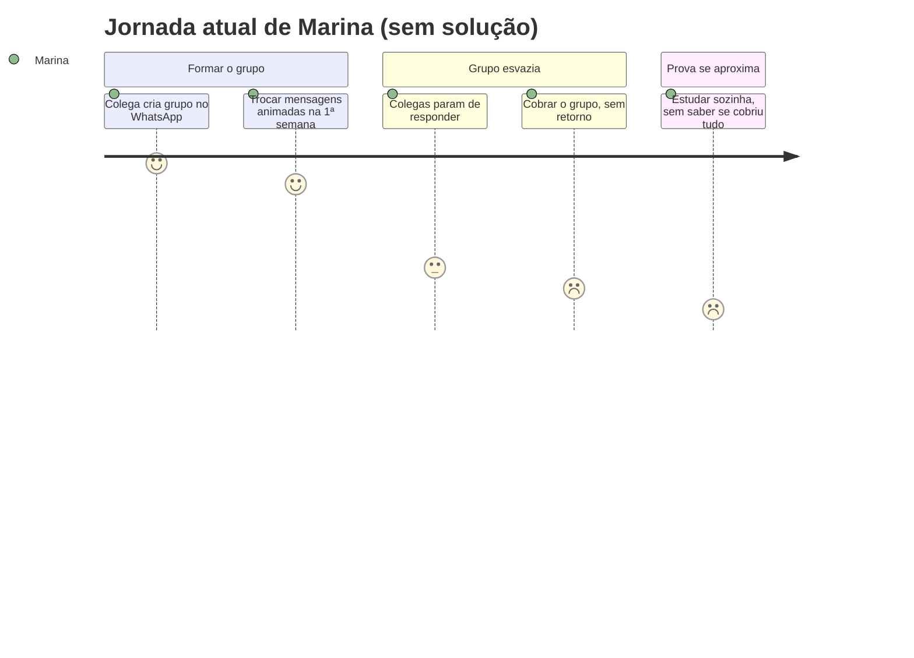

# Cenário de Análise/Problema

> **_NOTE:_**: A equipe deve pensar em cenários existentes na atualidade (que causam problemas para os usuários) e que a interface prevista ajudará a resolver o problema. Cenário de Análise/Problema é uma história triste. Não descreve a solução. Descreve somente o problema.

1) **Cenário de Análise/Problema**
- Escreva uma narrativa (não uma lista de requisitos) contando como a persona vive o problema hoje.
- Baseie-se nas dores identificadas no [Perfil do Usuário](3_perfil_usuario.md) e no [Mapa de Empatia](4_personas.md) — não invente um problema novo.
- Não mencione o produto/serviço que a equipe vai construir; a história descreve a vida da persona **antes** dele existir.

2) **Questões de Refinamento**
- Levante perguntas sobre o cenário que ainda ficaram em aberto: por que isso acontece? Acontece sempre ou só às vezes? Quem mais é afetado? O que a persona já tentou para resolver?
- O objetivo é encontrar lacunas e suposições no cenário inicial, não respondê-las ainda.

3) **Refinamento do Cenário de Análise/Problema**
- Reescreva o cenário incorporando as respostas às questões de refinamento, tornando-o mais específico, concreto e verificável.

4) **Contexto de Uso**
- Descreva o ambiente em que o problema ocorre (e onde o futuro produto/serviço deverá ser utilizado).
- Qual/quais o(s) contexto(s) sociais, econômicos e culturais existentes neste ambiente?
- Quais informações sobre o ambiente devem ser consideradas antes de qualquer interação?
- O que normalmente está acontecendo no ambiente quando o problema ocorre?

5) **Jornada do Usuário (atual, sem solução)**
- Descreva a jornada da persona enfrentando o problema **hoje**, do início ao fim do cenário — sem envolver o produto/serviço que a equipe vai construir.
- Aponte, em cada etapa, o estado emocional da persona (frustração, confiança, dúvida, satisfação).
- Complemente com um diagrama de jornada (`journey`) do Mermaid, agrupando as etapas em seções e atribuindo uma nota de 1 (péssimo) a 9 (ótimo) ao estado emocional de cada uma.

---

## Entrega

## PERSONA PRIMÁRIA N° 1

### 1) Cenário de Análise/Problema

Ricardo possui uma empresa de locação de caminhões com 25 veículos e administra praticamente toda a operação sozinho. Além disso, trabalha em regime CLT em outra empresa durante o dia. Atualmente, mantém o controle da frota, das obras, das manutenções, dos contratos e das contas por meio de diversas planilhas e anotações.

Durante o horário de trabalho CLT, surgem mensagens de motoristas, responsáveis pelas obras e fornecedores. Ricardo precisa consultar informações como onde determinado caminhão está, quando será necessário realizar uma manutenção ou se determinado cliente já realizou um pagamento. Porém, muitas dessas informações estão nas planilhas que ficam no computador, dificultando o acesso pelo celular.

Ele acaba tentando resolver algumas situações de memória ou pedindo informações por WhatsApp, enquanto outras demandas ficam para quando chega em casa. Com isso, sente que está sempre "correndo atrás" das informações e teme esquecer algum pagamento, manutenção, cobrança ou compromisso relacionado aos caminhões.

### 2) Questões de Refinamento

- Quais informações Ricardo precisa consultar com maior frequência enquanto está trabalhando na empresa CLT?
- O maior problema é a falta de acesso às planilhas pelo celular ou a própria organização das informações?
- Quantas vezes durante o dia Ricardo recebe demandas relacionadas aos caminhões e às obras?
- Quais tipos de problemas podem ser resolvidos rapidamente pelo celular e quais exigem que ele acesse o computador?
- Como Ricardo atualmente controla as manutenções e os vencimentos dos veículos?
- Ele consegue saber rapidamente quais caminhões estão disponíveis, locados, em manutenção ou parados?
- Como ele acompanha os valores que tem para receber das obras e os pagamentos que precisa realizar?
- O que acontece quando Ricardo não consegue responder imediatamente a uma solicitação de motorista, cliente ou fornecedor?
- Ele já tentou utilizar algum aplicativo ou outra ferramenta para substituir as planilhas? Por que não continuou utilizando?

### 3) Refinamento do Cenário de Análise/Problema

Ricardo concentra praticamente toda a gestão da empresa de locação em si mesmo. O problema não está apenas na quantidade de informações, mas na falta de acesso e centralização dessas informações durante o período em que ele está trabalhando na empresa CLT.

As informações sobre os 25 caminhões estão distribuídas entre planilhas, documentos, mensagens e anotações. Para descobrir a situação de um veículo, por exemplo, Ricardo pode precisar consultar uma planilha para verificar a obra em que está alocado, outra para verificar informações financeiras e registros separados para conferir manutenções.

Ele consegue administrar a empresa dessa maneira, mas isso exige que esteja diante do computador ou que mantenha muitas informações na memória. Quando recebe uma solicitação durante o trabalho CLT, frequentemente precisa interromper o que está fazendo, procurar a informação no celular ou deixar a resposta para depois.

O problema central, portanto, não é simplesmente "ter muitas planilhas", mas a dificuldade de transformar as informações da empresa em uma visão rápida, organizada e acessível de qualquer lugar. Ricardo precisa conseguir saber, pelo celular, o que está acontecendo com sua frota sem depender de estar em casa ou diante de um computador.

### 4) Contexto de Uso

Ricardo utiliza o sistema principalmente pelo celular durante o expediente CLT, nos intervalos ou quando recebe alguma demanda relacionada à empresa de locação. Também utiliza o sistema à noite, em casa, quando realiza atividades de gestão que exigem mais atenção.

Contexto profissional: Ricardo possui duas rotinas de trabalho. Durante parte do dia está empregado em regime CLT em outra empresa e, paralelamente, administra sua própria empresa de locação de caminhões.

Contexto operacional: Os 25 caminhões podem estar distribuídos entre diferentes obras, em manutenção, disponíveis ou em processo de locação. Motoristas, clientes, responsáveis pelas obras e fornecedores podem gerar novas demandas ao longo do dia.

Contexto financeiro: Ricardo precisa acompanhar contas a pagar, valores a receber, pagamentos de clientes, despesas relacionadas aos veículos e outros compromissos financeiros da empresa.

Contexto de manutenção: Problemas mecânicos e revisões podem surgir enquanto os caminhões estão trabalhando nas obras. Ricardo precisa registrar e acompanhar essas ocorrências para evitar que uma manutenção seja esquecida ou que um veículo fique indisponível por mais tempo que o necessário.

Contexto de uso do sistema: O aplicativo precisa funcionar como uma espécie de "central de controle da empresa no bolso", permitindo que Ricardo consulte rapidamente a situação dos caminhões, obras, manutenções e financeiro sem precisar abrir diversas planilhas ou estar diante do computador.

### 5) Jornada do Usuário (atual, sem solução) — Marina

| Etapa | O que acontece | Estado emocional |
| :---- | :---- | :---- |
| 1. Criação do grupo | Uma colega cria um grupo no WhatsApp e convida a turma para estudar juntos. | Animada |
| 2. Primeira semana | Mensagens trocadas com entusiasmo, mas sem definir quem estuda o quê. | Confiante |
| 3. Silêncio no grupo | Colegas param de responder; ninguém assume a organização. | Frustrada |
| 4. Tentativa de reverter | Marina manda uma mensagem cobrando o grupo; poucas ou nenhuma resposta. | Insegura |
| 5. Véspera da prova | Marina desiste do grupo e estuda sozinha, sem saber se cobriu os tópicos certos. | Exausta / decepcionada |

## PERSONA PRIMÁRIA N° 2

### 1) Cenário de Análise/Problema

Marcos é gerente de frota da IHC Saneamento e, além do trabalho na empresa, cursa engenharia civil. No dia a dia, é responsável por acompanhar a disponibilidade e a alocação dos veículos nas diferentes obras, receber as fichas de trabalho dos motoristas, controlar informações de combustível e acompanhar dados financeiros relacionados à operação.

Atualmente, grande parte desse controle é feita manualmente por meio de planilhas e fichas impressas. Marcos recebe informações de diferentes pessoas e precisa consolidá-las posteriormente, muitas vezes digitando os mesmos dados em diferentes planilhas.

Quando precisa descobrir rapidamente onde determinado veículo está, se está disponível ou qual foi sua utilização em determinado período, precisa procurar entre diferentes arquivos e registros. Além disso, relatórios e indicadores que poderiam ajudar na gestão da frota precisam ser montados manualmente.

Com o aumento das demandas, Marcos sente que passa mais tempo organizando e conferindo informações do que efetivamente analisando os dados e tomando decisões sobre a operação.

### 2) Questões de Refinamento

- Quais informações Marcos precisa atualizar com maior frequência durante o dia?
- Quantas fichas de trabalho são recebidas dos motoristas diariamente?
- Quais informações precisam ser digitadas mais de uma vez nas planilhas?
- Quanto tempo Marcos gasta semanalmente preenchendo e conferindo planilhas?
- Quais erros acontecem com maior frequência durante o preenchimento manual?
- Os motoristas entregam as fichas preenchidas corretamente ou Marcos precisa conferir e corrigir os dados?
- Quais informações ele precisa consultar com mais frequência: disponibilidade, alocação, combustível, pagamentos ou utilização?
- Quais relatórios Marcos precisa gerar e com que frequência?
- Os gestores conseguem acompanhar os indicadores da frota sem depender diretamente de Marcos?
- Marcos já tentou utilizar alguma ferramenta para automatizar esses processos? O que dificultou a adoção?

### 3) Refinamento do Cenário de Análise/Problema

Marcos é um dos principais responsáveis por transformar as informações geradas diariamente pelos motoristas e pelas obras em dados úteis para a gestão da frota. Porém, esse processo ainda depende de registros físicos e diversas planilhas.

As informações chegam de maneira descentralizada: motoristas preenchem fichas, responsáveis pelas obras repassam informações sobre os veículos e Marcos precisa consolidar tudo manualmente. Depois, utiliza esses dados para atualizar controles de disponibilidade, alocação, combustível, pagamentos e outros indicadores da operação.

O problema não está apenas no preenchimento das planilhas, mas no fato de que Marcos acaba sendo responsável por grande parte da organização e validação das informações da frota. Pequenos erros de preenchimento ou dados esquecidos podem gerar inconsistências nos relatórios e exigir novas conferências.

Além disso, como os relatórios e indicadores são construídos manualmente, Marcos dedica tempo a tarefas operacionais que poderiam ser automatizadas. Isso reduz o tempo disponível para analisar o desempenho da frota, identificar problemas e apoiar as decisões da empresa.

O problema central, portanto, é a dependência de processos manuais para coletar, organizar, consultar e transformar os dados da frota em informações úteis para a gestão.

### 4) Contexto de Uso

Marcos utiliza o sistema principalmente durante o expediente na IHC Saneamento, alternando entre computador e smartphone para acompanhar as informações da frota e das obras.

Contexto profissional: Marcos atua como gerente de frota e precisa acompanhar diversos veículos simultaneamente, além de lidar com motoristas, gestores de obras e outros setores da empresa.

Contexto operacional: Os veículos estão distribuídos entre diferentes obras e possuem diferentes situações de disponibilidade, utilização e manutenção. Marcos precisa saber rapidamente onde cada veículo está e qual é sua situação atual.

Contexto de coleta de dados: Os motoristas são responsáveis por fornecer informações sobre a utilização dos veículos por meio das fichas de trabalho. Essas informações posteriormente precisam ser conferidas e inseridas nos controles utilizados por Marcos.

Contexto de gestão: Marcos precisa transformar os dados coletados em relatórios e indicadores para que a empresa consiga acompanhar a operação, os custos, os pagamentos, o consumo de combustível e a utilização dos veículos.

Contexto de uso do sistema: O sistema deve reduzir a necessidade de preenchimento manual e permitir que os dados sejam registrados diretamente pelos responsáveis. Marcos deve conseguir consultar as informações centralizadas, acompanhar indicadores automaticamente e gerar relatórios sem precisar consolidar manualmente diferentes planilhas.

### 5) Jornada do Usuário (atual, sem solução) — Marina

| Etapa | O que acontece | Estado emocional |
| :---- | :---- | :---- |
| 1. Criação do grupo | Uma colega cria um grupo no WhatsApp e convida a turma para estudar juntos. | Animada |
| 2. Primeira semana | Mensagens trocadas com entusiasmo, mas sem definir quem estuda o quê. | Confiante |
| 3. Silêncio no grupo | Colegas param de responder; ninguém assume a organização. | Frustrada |
| 4. Tentativa de reverter | Marina manda uma mensagem cobrando o grupo; poucas ou nenhuma resposta. | Insegura |
| 5. Véspera da prova | Marina desiste do grupo e estuda sozinha, sem saber se cobriu os tópicos certos. | Exausta / decepcionada |

